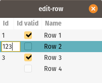

Gtk C++ Snippets
============

This is where I collect workflows and behaviors for Gtk (gtkmm) that others might find useful. Feel free to use them, they are licensed with MIT license.

Building and installing
-----------------------
```sh
$ mkdir build
$ cd build
$ cmake ..
$ make
```

Contents
--------

### edit-row


Make a Gtk::TreeView more useful for data entry.
* Allow integer columns to have no value which shows as an empty string. Editing the field with a valid int will make the field value.
* Jump to next editable field when a field is edited. This makes it possible to do data entry with the keyboard by pressing enter between each field. Editing the last field in a row jumps to the first field of the next row. If on the last row a new row will be added.

License
-------
All code is licensed with MIT license, a permissive license. See LICENSE for more information.